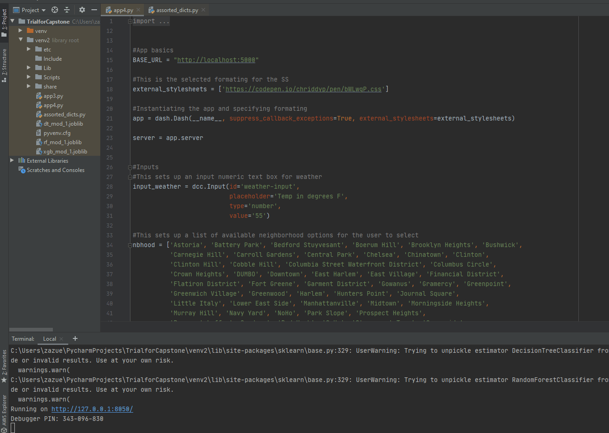

# Capstone Project - Citibike trip planner

## Abstract
New York City residents utilize a number of modes of transportation to get from place to place and need to know they can rely on their preferred mode when they need it. One popular method is the shared bike system operated by Citibike. Citibike has stations in Manhattan, Queens, Brooklyn, and Jersey City. While Citibike does offer information in their application about the real-time availability of their bikes at a given station, there is no application that would allow a biker to know ahead of time whether they can rely on a bike being available at their station of choice (that I know of). I will aim to solve that problem by constructing a dash application a Citibike user could utilize to plan a trip using a bike from their station of choice.

## Contents
The process for gathering and cleaning the data and modeling it can be found in the Cap 1-3 notebooks.

The code for the dash app can be found in the app4.py file. I used PyCharm to run that. You will need to run the code in Cap2-Trees to have the random forest model that is used in the dash application.

## Libraries
Here are some of the main libraries and packages I used:
```
import pandas as pd 
import requests #For API calls
import datetime #For feature formatting
import matplotlib.pyplot as plt #Viz
%matplotlib inline
import seaborn as sns #Viz
import time #for the API call I don't use
import os #For the weather call
import json #file formatting
from pandas.io.json import json_normalize #file formatting
from sklearn.utils import resample

from wwo_hist import retrieve_hist_data #historical weather 
from mapbox import Geocoder

import folium
from folium.plugins import MarkerCluster
```

## Data
The data for this project will come from Citibike System Data. Ideally I would be able to run an API call on their station information, collecting minute by minute availability of bike traffic over the course of the day for a number of weeks. However, at the time I was collecting information for this project, NYC was under a shelter-in-place order to help stop the spread of the novel coronavirus, COVID-19. Given the halt on normal city traffic, I needed a different approach.

I had to utilize rider data from April 2019 and manipulated it to generate a rolling count of bikes being checked in and out of stations. I paired that traffic data with other general information about the stations and ended up with a dataset that had approximate station counts for 741 stations 24/7 for the month. I made daily adjustments to the counts to account for station capacity, and believe this adjustment roughly captured the process of station refilling - where Citibike will shift bikes en masse during off hours to restock empty stations that are popular start points but unpopular destination stations/remove bikes from popular destination stations so more bikes can be docked there.

I also wanted to use weather as a predictive input - intuitively there will likely be more bike traffic when it is nice out and less bike traffic when there is inclement weather.

And while some geographical information was provided in the Citibike datasets, I knew I wanted to pull in more granular information, specifically the NYC neighborhoods where the stations were located.

Here is a visualization of the location of the stations across the city and the code I used with the folium package to visualize it:

```
m = folium.Map(location=[stat_info.loc[17][3], stat_info.loc[17][4]], zoom_start=11.5)

k = ['red', 'blue', 'green', 'purple', 'orange', 'darkblue', 'beige', 'pink', 
     'black', 'lightgray']

marker_cluster = MarkerCluster().add_to(m)

x = 0
for i in stat_info.index:
    if x <10:
        x = x
    else:
        x=0
    c = k[x]
    folium.Marker(location=[stat_info.loc[i][3], stat_info.loc[i][4]], tooltip=str(stat_info.loc[i][5]), 
                  icon=folium.Icon(color=c)).add_to(marker_cluster)
    x+=1
m
```


## Data Sourcing
The citibike information comes from two places.

The station information is pulled from their APIs: http://gbfs.citibikenyc.com/gbfs/gbfs.json.
The historical data I use is coming from their Citi Bike Daily Ridership and Membership Data here: https://www.citibikenyc.com/system-data
I use historical weather data from New York that is sourced from the World Weather Online Developer Portal API here: https://www.worldweatheronline.com/developer/api/docs/historical-weather-api.aspx

I use MapBox for geospatial data to identify NYC neighborhoods

## Process
After gathering and cleaning the data, I fit and tuned various Machine Learning classification models to predict, given a number of inputs, a classification problem of whether the number of bikes at the station at a given time will be low, medium, or high.

The output is code for a web based application deployed in dash.



## Takeaways
The model that went into the dash app was a Random Forest Classification model. It had an overall training accuracy of 86.68%. The accuarcy for the 'Low' station status class was 92% - this is important to note because I believe this class to be most sensitive for clients.

If I were to do this project again at a different time (not during a city lockdown for a global pandemic), I would use this code to source the data. The below code will query the station status API CitiBike has. This API will list the number of bikes in a station at the time of the call. What this method would capture, which the data I use does not capture, is the refilling of stations conducted by CitiBike crews - there are some stations that will more often act as end stations or start stations, meaning more bikes will be removed from the station than returned over the course of the day, therefore leaving the station empty with little likelihood of refilling or the stations are more consistently full, limiting the use of the station as a dock to return a bike. To remedy this, crews will move excess bikes from the full stations to the emptier stations to rebalance availability.

The below code tracks a start time, generates a blank count and an empty dataframe, and then pulls a request every X seconds from the listed API, appending the DF and adding a count. The current code is written to repeat every 15 minutes (900 seconds) for 10 hours (count <40). I would likely pull this every 2 minutes for 12 hour periods for a month to obtain a similar data set.
